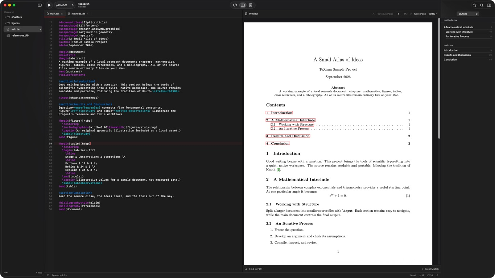

# TeXium

A native macOS workspace for writing, typesetting, and exploring LaTeX. Projects are ordinary folders; source stays editable in any other editor. Compilation, PDF navigation, references, search, templates, and revision history work locally without an account.



## What works

- Multiple project windows, recent projects, pinned projects, native file navigation, tabs, and Settings.
- An AppKit text editor with incremental LaTeX coloring, line numbers, native undo/find, brace and environment matching, indentation, completion, and outline navigation.
- Local `latexmk` builds with pdfLaTeX, XeLaTeX, LuaLaTeX, or LaTeX → PDF; debounced automatic builds, cancellation, structured diagnostics, and complete logs.
- PDFKit preview, thumbnails, search, zoom, printing, export, and bidirectional SyncTeX. Failed builds preserve the last successful PDF.
- BibTeX browsing and citation completion; equation, table, figure, and symbol assistants; local notes and `texcount` word counts.
- Content-addressed local snapshots, revision comparison/restoration, Git status/staging/commits/branches/remotes, ten built-in templates, validated ZIP import, and source/submission exports.
- GitHub connection and clone, incoming/outgoing status, commit review, fast-forward synchronization, and optional HTTPS tokens in macOS Keychain. See [GitHub setup and synchronization](docs/GITHUB.md).
- Atomic coordinated saves, external-change comparison, crash recovery copies, UTF-8/UTF-16 BOM handling, and LF/CRLF preservation.

The implementation contains no browser view, application server, account system, or collaboration infrastructure. Optional Git network actions use installed Git with SSH, existing credential helpers, or a token stored in Keychain through Settings → GitHub.

## Requirements

**Run:** macOS 14 Sonoma or later. The Release target produces an Apple silicon / Intel universal application. Validation was performed on Apple silicon with macOS 26.5.2; older supported systems and Intel hardware still need release qualification.

**Develop:** Xcode 15.3 or newer with its command-line tools selected. The checked-in project was built with Xcode 26.6 / Swift 6.3.3, using Swift 5 language mode. There are no third-party Swift package dependencies. Python 3 is needed only when regenerating the Xcode project.

**Typeset:** an installed TeX distribution, normally MacTeX or BasicTeX plus `latexmk` and the packages used by your document. TeXium does not bundle or download TeX. `synctex` enables source/PDF navigation, `texcount` enables word counts, and BibTeX/Biber are needed by the corresponding bibliography styles. The editor opens without TeX installed and gives a setup explanation when compilation is requested.

TeX discovery checks a configured directory, `/Library/TeX/texbin`, common Homebrew locations, and `PATH`. Use **Settings → LaTeX → Test LaTeX Installation** to inspect the installed tool versions.

## Build and run

```sh
./script/build_and_run.sh
```

This is also the configured Codex **Run** action. Release builds also create `dist/TeXium-macOS.zip` from a clean staging bundle. It builds the Xcode app, copies it to `dist/TeXium.app`, verifies its signature, and launches it. A running TeXium is asked to save and quit normally; a save conflict stops relaunch rather than discarding edits.

```sh
./script/build_and_run.sh --verify      # Build, launch, watch startup/restoration for 10 seconds
./script/build_and_run.sh --build-only  # Build without closing editor windows
./script/build_and_run.sh --debug       # Run under LLDB
./script/build_and_run.sh --telemetry   # Local OSLog build events
CONFIGURATION=Release ./script/build_and_run.sh --build-only
```

Open `TeXium.xcodeproj`, choose the **TeXium** scheme, and Run to work directly in Xcode. Its application target is named `TeXiumDesktop` to distinguish it from the SwiftPM executable target. Run `python3 script/generate_project.py` after adding or removing application source files. The core library and its tests are also a standalone Swift package.

Build products use a temporary DerivedData directory to avoid Finder metadata on document-provider folders interfering with code signing. Override `TEXIUM_BUILD_DIR` if needed. `.build/` and `dist/` are disposable, ignored output directories.

## Try the sample

1. Open `Fixtures/Research` using **File → Open Project**.
2. Select `main.tex`, then press **⌘R**. The sample produces two pages with an included chapter, a figure, table, equation, references, and bibliography.
3. Select an outline heading to navigate the source. Press **⌘⇧J** to show it in the PDF. Command-click the PDF, or use **Show Source Here** in its context menu, to navigate back.
4. Use the inspector to browse Problems, Log, References, History, Git, Notes, and Statistics.
5. Export a PDF or source archive from the File menu.

| Shortcut | Action |
| --- | --- |
| ⌘N / ⌘O | New project / Open project |
| ⌘S | Save all edited project buffers |
| ⌘R | Compile |
| ⌘F / ⌥⌘F | Native file find / Project search |
| ⌘⇧J | Source → PDF |
| ⇧⌘U | Synchronize the selected repository |
| Escape | Native context completion |
| ⌘/ | Comment / uncomment |
| ⌘B / ⌘I | Bold / italic |
| ⌘⇧M | Symbol palette |
| ⌘, | Settings |

## Tests

```sh
./script/test.sh
./script/test_ui.sh
```

The suite includes an isolated synthetic Keychain round-trip and requires a logged-in macOS session with Keychain access. The core suite covers parser offsets, encodings, conflicts, traversal/symlinks, history integrity, search/replace, archive validation, Git, process cancellation, actual bibliography builds, all four engines, every bundled template, PDF output, and bidirectional SyncTeX. TeX-dependent tests report skips when required tools are absent; inspect the report rather than interpreting a skip as a pass.

UI tests use the separate bundle identifier `app.texium.verification` and a disposable fixture copy. They require a logged-in graphical session with Xcode UI automation enabled. `TEST_ACTION=build-for-testing ./script/test_ui.sh` checks that the runner and app build without requesting UI execution.

See [validation results and remaining acceptance work](docs/ACCEPTANCE.md).

## Storage and architecture

`Sources/TeXium` owns scenes, menus, per-window stores, and native views. `Sources/TeXiumCore` owns portable models, parsers, and filesystem/process services. SwiftUI manages the desktop interface; focused AppKit bridges supply TextKit editing, PDFKit, window lifecycle, file panels, and FSEvents.

Project configuration, recovery, notes, and history live under `~/Library/Application Support/TeXium/Projects/<path-hash>/`. Preferences and recents use UserDefaults. Generated TeX output is isolated in each project's `.texium-build/`; `preview/` retains the last successful PDF and SyncTeX. Source files remain canonical.

Read [architecture](docs/ARCHITECTURE.md), [security and file integrity](docs/SECURITY.md), and [signing and release instructions](docs/DISTRIBUTION.md).

## Release status and limits

This is a working **0.1 developer release**, not a notarized public release. Local builds are ad-hoc signed. A Developer ID certificate, release acceptance testing, and Apple's notarization service are still required for distribution.

- No optional visual editor, AI provider, online reference lookup, general-purpose cloud folder synchronization, or updater is included.
- No code folding, multiple cursors, or Vim/Emacs modes. Completion uses a built-in command vocabulary plus project keys and filenames; it does not interpret arbitrary package definitions.
- Outline, diagnostics, and bibliography parsers are practical source parsers, not a TeX interpreter. BibTeX string macros are preserved but not fully expanded in the browser.
- TeX's arbitrary source execution is not an OS security sandbox. Only compile trusted projects; see the security document. Project `.latexmkrc` files are deliberately ignored. Index/glossary recipes requiring custom rules need an explicitly configured custom build command.
- History is local, path-associated, and not a backup service. Hidden files and directory symlinks are omitted. Files over 256 MB block snapshots; editor text files are limited to 32 MB. There is no history retention/pruning UI yet.
- UTF-8 and BOM-marked UTF-16 are supported. Other legacy encodings require conversion in another editor. Table assistance is limited to 12×12 cells and a simple first-row merge.
- Build location is currently fixed; PDF refresh preserves page/position in-process and restores page/zoom between launches. Exact split-divider positions are left to native split-view behavior rather than explicitly persisted.
- Submission exports collect project source and available `.bbl` files; they do not certify publisher-specific requirements or discover every dependency created by arbitrary TeX macros.
- Large-document performance, complete VoiceOver coverage, older macOS releases, and Intel runtime behavior need broader qualification before a public release.
