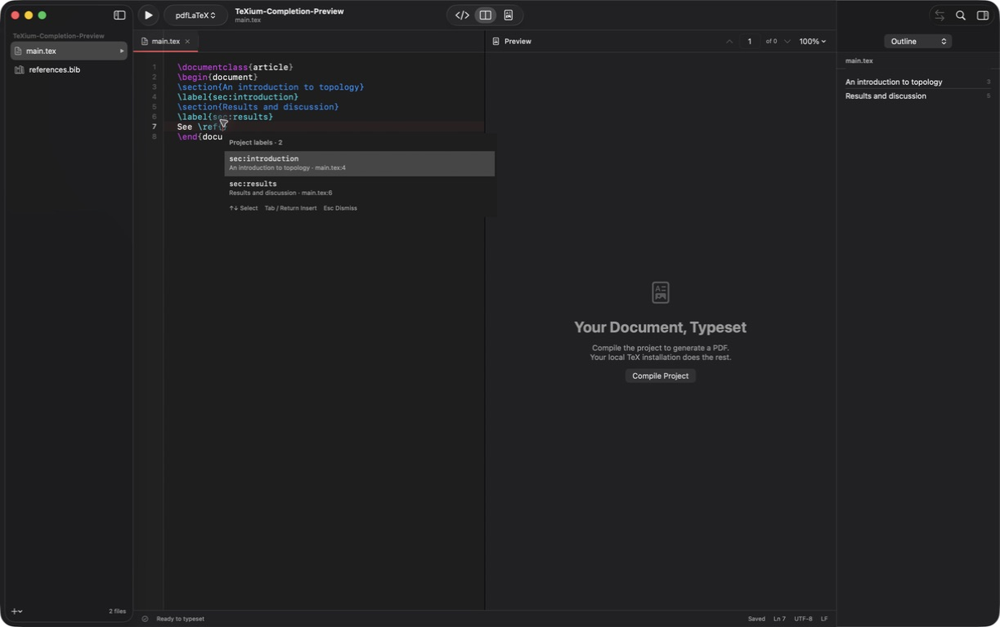

# Context-aware code completion

Enable **Settings → Editor → Automatic code completion**. Suggestions appear beside the insertion point as you type. Use **↑ / ↓** to choose, **Tab or Return** to insert, and **Escape** to dismiss. **Control-Space** opens suggestions manually; **Edit → Complete LaTeX** (**Control-Escape**) is also available if macOS reserves Control-Space for input-source switching.

| Context | Suggestions |
| --- | --- |
| `\sec` | Section commands with a title argument, including starred variants |
| `\fra` | `\frac{}{}` with Tab navigation through numerator and denominator |
| `\ref{…}`, `\autoref{…}`, `\cref{…}` | Project label keys, with the preceding section heading and source location |
| `\cite{…}`, `\citep[see][p. 3]{…}`, `\textcite{…}` | Bibliography keys, searchable by key, title, author, year, and other local BibTeX fields |
| `\section{Intro…}` | Matching existing project heading titles |
| `\begin{…}` / `\end{…}` | Common LaTeX environments |
| `\input{…}`, `\includegraphics{…}`, `\addbibresource{…}` | Project files filtered for the command |

Completion reads unsaved edits as well as files on disk. In a multi-key citation or reference, it replaces only the current key and preserves the rest. Labels can be found by their section title as well as their key. Command suggestions insert argument braces and place the cursor inside the first argument; Tab moves to subsequent arguments and then beyond the command. Existing arguments remain intact when completing a command in the middle of text. Acceptance is a single undoable edit.

Custom commands declared with `\newcommand`, `\renewcommand`, `\providecommand`, or `\DeclareRobustCommand` in project `.tex`, `.sty`, and `.cls` files are indexed, including their required argument count. Comments, inline `\verb`, and common verbatim/code environments suppress suggestions and symbol indexing. This is a source-aware completion engine, not a TeX interpreter: unusual category-code changes, dynamically constructed macros, and installed package definitions are not expanded.

The interaction follows Overleaf's automatic command/reference workflow and its [project citation search](https://docs.overleaf.com/citing-and-references/adding-citations-and-references/searching-for-references), including filtering by citation key and bibliographic metadata. TeXium uses local project files; reference-manager integrations and Overleaf's online services are not part of this feature.
